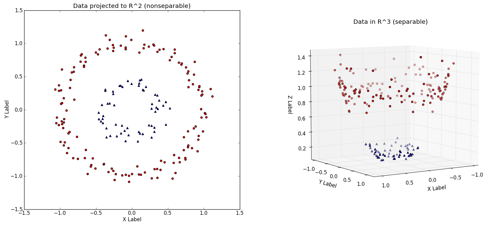
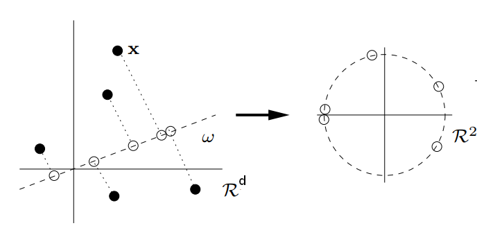
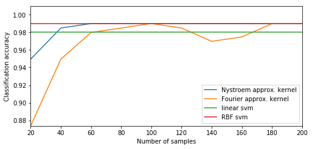
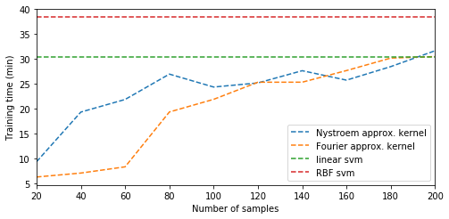
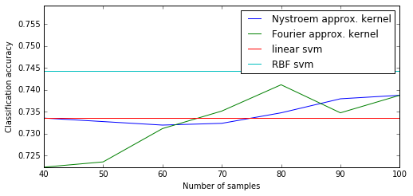
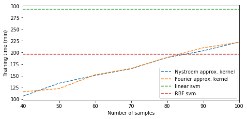
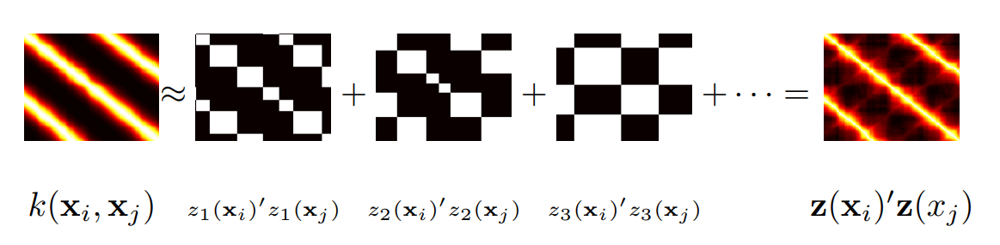

```{r setup, include=FALSE}
knitr::opts_chunk$set(echo = TRUE)
knitr::opts_chunk$set(cache = TRUE)
```

## Introduction | Kernel methods {.build}

<!-- link utili:

https://www.quora.com/In-machine-learning-what-is-a-feature-map 

https://users.soe.ucsc.edu/~niejiazhong/slides/ratsch.pdf
-->

Kernel methods start from the idea of projecting data points from the input space into a high-dimensional feature space through a positive-definite **feature map** $\phi:\mathcal{X}\rightarrow\mathcal{F}$, in order to make training data easier to regress or classify.

<!-- and searching for the optimal **separating hyperplane** in that feature space. -->

<div class='columns-2'>



<br>

The corresponding **kernel function** $k(x,x')=<\phi(x),\phi(x')>_{\mathcal{F}}$ defines an inner product in that feature space and allows to perform the so called **kernel trick**:

one can avoid the explicit calculation of the feature map, by *working only with inner products between training points*.

</div>

## Introduction | Larges-scale problems {.build}

The main limitation of kernel methods is their high **computational cost**, which is at least quadratic in the number of training points, due to storage and computation of the kernel matrix $K$.

<!-- One of the characteristics of kernelized algorithms is that their runtime and space complexity is basically independent of the dimensionality of the input space, but rather scales with the number of data points used for training. -->

Low-rank decompositions of $K$ (like **Cholesky decomposition**) are less expensive , but they still require its computation.

<br>
<div align="center">
*What if we avoid computing the whole kernel matrix?*


We are now going to explore **Nyström method** and **random Fourier features**, <br> two methods based on **low-rank approximations** of $K$.
</div>

For the sake of simplicity, we'll focus on the **Radial Basis function kernel**
$$
k(x,y) = exp\big(-\gamma\Vert x-y\Vert_2^2\big),
$$
in which case both methods are valid.

<!-- make some comparisons between them and show some interesting results on performances. -->

# The boring stuff

## Notation {.build}

- $k:\mathcal{X}\times\mathcal{X}\rightarrow \mathbb{R}$ is a kernel function $\big(\mathcal{X}\subseteq \mathbb{R}^d\big)$;
- $\mathcal{H}_k$ is the corresponding Reproducing kernel Hilbert space;
- $\mathcal{D}=\{(x_1,y_1),\dots,(x_N,y_N)\}$ is a collection of training data;
- $\mathcal{H}_{\mathcal{D}}=span(k(x_1,\cdot),\dots,k(x_N,\cdot))$ is a subspace of $\mathcal{H}_k$.


<br>

Our general goal is to efficiently solve a **regularized least squares problem** 
$$
\min_{f\in\mathcal{\mathcal{H}_\mathcal{D}}} \frac{\lambda}{2} \Vert f\Vert^2_{\mathcal{H}_\mathcal{D}} + \frac{1}{N} \sum_{i=1}^N l(f(x_i),y_i)
$$
by restricting the solution to an approximate **randomly generated** functional subspace
$\mathcal{H}_a\subseteq \mathcal{H}_\mathcal{D}$.

<!-- uso H_d invece di H_k per il representer theorem!! -->


## Nyström method {.build}

Take $m$ **random samples** (uniform sampling without replacement is the most used approach) $\hat{\mathcal{D}} = \{\hat{x}_1,\dots, \hat{x}_m\}$ of training points and consider the corresponding kernel matrix $\hat{K} = [k(\hat{x}_i,\hat{x}_j)]_{m\times m}$.

The main idea of the algorithm is to **approximate $K$** by the low-rank  matrix
$$
{\tilde{K}}_r = K_b \hat{K}^+ {K_b}^{-1},
$$
where $rank(\hat{K}) = r<m$, $K_b=[k(x_i,\hat{x}_j)]_{N\times m}$ and $\hat{K}^+$ is the Moore-Penrose pseudo inverse of $\hat{K}$ **[1, p.2]**.


<!--principale: http://www.jmlr.org/papers/volume6/drineas05a/drineas05a.pdf -->
<!-- https://www.cs.cmu.edu/~muli/file/nystrom_icml10.pdf -->
<!-- http://www.jmlr.org/papers/volume13/kumar12a/kumar12a.pdf -->

Given the eigendecomposition $\tilde{K}_r=\hat{V}_r\hat{D}_r\hat{V}_r^t$
we can now derive a vector representation of data 
$$
z_n(x) = \hat{D}^{-1/2}_r \hat{V}^t_r (k(x,\hat{x}_1),\dots,k(x,\hat{x}_m))^t \in \mathbb{R}^r.
$$


## Nyström method {.build}

Thanks to this vector representation we can learn the linear machine $f(x)=w^t z_n(x)$ by solving 
<!-- spiegare cosa sono le matrici di eigendecomposition -->

$$
\min_{w\in\mathbb{R}^r} \frac{\lambda}{2} \Vert w\Vert^2_2 + \frac{1}{N} \sum_{i=1}^N l(w^t z_n(x_i),y_i),
$$
which is equivalent to our original problem, under the assumption of searching the linear machine into the approximate subspace $\mathcal{H}_a := span(z_1(\cdot),\dots,z_n(\cdot))\subseteq\mathcal{H}_\mathcal{D}$ **[2, p.3]**.

<br>

This method reduces storage and computation **complexities** of the Gram matrix <br> from $O(N^2)$ and $O(N^3)$ to $O(Nr)$ and $O(Nr^2)$ respectively, where $r$ is the rank of the approximation.
<!-- so they are linear in N! -->


## Random Fourier features {.build}

<!-- dimostrazioni
https://pdfs.semanticscholar.org/presentation/eb4a/b4711aad9524d58e69f416ec3a8889cd4313.pdf-->

Also known as **Random kitchen sinks** method, random Fourier features can be applied to all shift-invariant kernels, i.e. kernels of the form  $k(x,y)= k(x-y)$, since it relies upon the following result.

**Theorem.** *(Bochner) A continuous shift-invariant kernel is positive definite if and only if it is the Fourier transform of a non-negative Borel measure.*

In the case of gaussian kernel, the theorem implies that the Fourier transform of $k$ defines a multivariate gaussian probability distribution on $\mathbb{R}^d$:

<!-- controllare questa frase!!! -->

$$
p(w)=\int_{\mathbb{R^d}}e^{-i w^t \delta} k(\delta) d\delta\sim \mathcal{N}(0,I/\sigma^2) 
$$

By projecting data onto **randomly chosen lines** with directions $w_1,\dots,w_m$ drawn from $p$, we guarantee that the inner product of two transformed points approximates the shift invariant kernel $k$ **[3]**.

## Random Fourier features {.build}

The idea is to wrap these lines onto the unit circle through $z_w(x)=e^{iw^tx}$

<div align='center'>

</div>

so that, given $z_p(x)=(z_{w_1}(x),\dots,z_{w_m}(x))$, we have the following kernel representation
$$
k(x,y)=\int_{\mathbb{R^d}} e^{iw^t(x-y)} p(w) dw = E[z_p(x)z_p(y)^*].
$$

## Random Fourier features {.build}

We can now use the top $r$ normalized eigenfunctions $\hat{\varphi}_i$ of the linear operator $$L_m[f]:=\frac{1}{m}\sum_{i=1}^m k(\hat{x_i},\cdot)f(\hat{x_i})$$ to set the **approximate space** to $\mathcal{H}_a := span(\hat{\varphi}_1,\dots,\hat{\varphi}_r),$
 and learn the linear machine $f(x)=u^t z_p(x)$:

$$
\min_{u\in\mathbb{R}^m} \frac{\lambda}{2} \Vert u\Vert^2_2 + \frac{1}{N} \sum_{i=1}^N l(u^t z_p(x_i),y_i).
$$

<!-- complessità computazionale??? -->

<br>

<div align='center'>
This method reduces storage and computation **complexities** of the Gram matrix <br> from $O(N^2)$ and $O(N^3)$ to $O(Nm)$ and $O(Nm^2)$ respectively.
</div>

## Theoretical comparison {.build}

<div align='center'>

*The high computational cost of kernel methods is due to  searching  <br>  for an optimal solution over a **large space** * $\mathcal{H}_\mathcal{D}$.

</div>
<br>
<div align='center'>

Both methods solve this problem by considering a randomly generated subspace $\mathcal{H}_a\subseteq \mathcal{H}_\mathcal{D}$. 


</div>

<br>

<div align='center'>

The main difference is in the **sampling method** chosen for the basis functions spanning this space: 
random Fourier features samples from a **data-independent** distribution ($z_p(x)$), <br> while Nystroem method from a **data-dependent** distribution ($z_n(x)$).


This implies a significant impact on the **performances**: the error bound is $O(N^{-1/2}+m^{-1/2})$ for kernel learning based on random Fourier features **[5]**, and $O(m^{-1/2})$ for Nystrom method. 
</div> 

<!-- meaning that the first eigenvalues of the kernel matrix are much larger that the others -->

# Testing phase

<!-- ## Empirical results {.build} -->

<!-- <div align='center'> -->
<!-- *Let's now make this discussion concrete* <br> and show some results on **SVM classifiers** and **kernel PCA**. -->
<!-- </div> -->

## Empirical results | SVM classification {.build}

Both methods are provided by `scikit-learn` library as `RBFSampler` and `Nystroem` **[4]**. 
<!-- By default nystroem uses the rbf  -->

I tested them against the **exact kernel methods** on **large enough** datasets, in order to show the improvements in performances.

``` python
# SVM classifiers
kernel_svm = svm.SVC(kernel='rbf', gamma=gamma, C=C)
linear_svm = svm.SVC(kernel='linear', C=C)
# the two methods
random_fourier = RBFSampler(gamma=gamma, random_state=1)
nystroem = Nystroem(gamma=gamma, random_state=1)
# pipelines for kernel approximations
fourier_svm = pipeline.Pipeline([("feature_map", random_fourier),("svm", linear_svm)])
nystroem_svm = pipeline.Pipeline([("feature_map", nystroem),("svm", linear_svm)])
```

`C` and `gamma` parameters were chosen by using `GridSearchCV` on a random small subset of the observations.
``` python
param_grid = {'C': [1, 10, 100, 1000], 'gamma': [1, 0.1, 0.01, 0.001]} 
```
<!-- dire anche le caratteristiche di galileo? -->

## Empirical results | SVM on Adult dataset {.build}


<div align='center'>
Binary classification on 123 features

30162 training - 15060 test
</div>

<!-- linear accuracy = rbf accuracy means that data is linearly sep -->

<div class='columns-2'>


<br>
<br>


</div>

## Empirical results | SVM on Covtype dataset

<div align='center'>

54 features and 7 classes

40000 training - 10000 test
</div>

<!-- classificazione binaria -->
<!-- linear accuracy = rbf accuracy (linearly sep) -->

<div class='columns-2'>


<br>
<br>


</div>

## Interesting considerations {.build}

<div align='center'>
These low-rank matrix approximations, based on the idea of solving non-linear problems using linear tecniques,  offer significant computational speed-up of all large-scale kernel learning methods.
</div>
<br>


<div align='center'>
In the case of a large eigengap **Nyström** method shows significant improvements in the approximation error (up to $O(1/m)$), because it is quicker at discovering the subspace spanned by the top eigenvectors **[2, p.4]**.
</div>
<br>


## Interesting considerations | PCA on MNIST dataset {.build}

<div align='center'>
Comparing PCA methods on *20000 samples* vs *50 random samples*.

Projecting on the first **10 principal components**.


**Explained variance**
```
PCA:           [1.0767615  0.17251632 0.16026771 ..]
Kernel PCA:    [0.04455248 0.00388329 0.00378083 ..]
Fourier PCA:   [0.05280394 0.01386613 0.01111522 ..]
Nystroem PCA:  [0.04452722 0.00361673 0.00343708 ..]

```
</div>
<div class="columns-2">

**Explained variance ratio**

```
Kernel PCA:    [0.354843   0.03092884 0.03011284 ..]
Fourier PCA:   [0.36885661 0.09686044 0.07764426 ..]
Nystroem PCA:  [0.68685186 0.05578958 0.05301842 ..]
```

<br>

**Execution time (s)**
```
Kernel PCA:    589.1665153503418
Fourier PCA:   0.6793737411499023
Nystroem PCA:  1.8425300121307373
```
</div>

<!-- ## Interesting considerations | PCA on MNIST dataset -->

<!-- <iframe height="100" width="450"  scrolling="no" seamless="seamless" frameBorder="0" src="mnist_kpca_20000.html"></iframe> -->

<!-- ## Interesting considerations | PCA on MNIST dataset -->

<!-- <iframe height="100" width="450" scrolling="no" seamless="seamless" frameBorder="0" src="mnist_foupca_20000.html"></iframe> -->

<!-- ## Interesting considerations | PCA on MNIST dataset -->

<!-- <iframe height="100" width="450" scrolling="no" seamless="seamless" frameBorder="0" src="mnist_nyspca_20000.html"></iframe> -->

## Interesting considerations {.build}

<div align='center'>
Another interesting method is **Random Binning features**, based on randomly shifted grids of points.


</div>

<div align='center'>
Random Fourier features perform better on **interpolation tasks**, due to the construction of smooth basis functions, while Random Binning features adapts better to **memorization tasks** **[3]**.
</div>


## References

[1] P. Drineas, M. W. Mahoney, "On the Nystrom Method for Approximating a Gram Matrix for Improved Kernel-Based Learning", 2005, http://www.jmlr.org/papers/volume6/drineas05a/drineas05a.pdf;

[2] T. Yang, Y.-F. Li, M. Mahdavi, R. Jin and Z.-H. ZhouNystrom, "Nystrom Method vs Random Fourier Features: A Theoretical and Empirical Comparison", 2012, NIPS, https://papers.nips.cc/paper/4588-nystrom-method-vs-random-fourier-features-a-theoretical-and-empirical-comparison.pdf;

[3] A. Rahimi and B. Recht, "Random features for large-scale kernel machines" , 2007, NIPS, https://www.robots.ox.ac.uk/~vgg/rg/papers/randomfeatures.pdf;

[4] "Explicit feature map approximation for RBF kernels", scikit-learn library, http://scikit-learn.org/stable/auto_examples/plot_kernel_approximation.html#sphx-glr-auto-examples-plot-kernel-approximation-py;

[5] A. Rahimi and B. Recht, "Weighted Sums of Random Kitchen Sinks: Replacing minimization with randomization in learning", 2009, https://people.eecs.berkeley.edu/~brecht/papers/08.rah.rec.nips.pdf;

[6] M. Mahdavi, T. Yang and R. Jin, "An Improved Bound for the Nystrom Method for Large Eigengap", 2012, https://arxiv.org/pdf/1209.0001.pdf.

# Thank you for your attention
          


